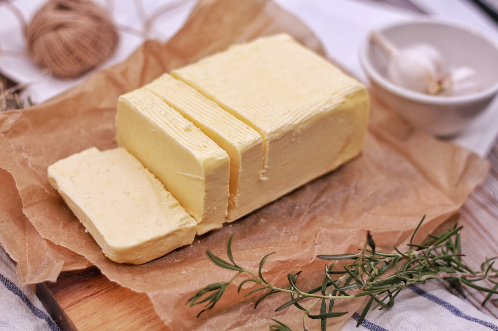

# Pan-Seared Filet Mignon Recipe

This is a simple recipe about making a pan-seared filet mignon with a delecious garlic butter. Pan-searing a steak is an excelent way to add texture to the meat. 

# Details
* Prep Time: 10 Minutes
* Cook Time: 10 Minutes
* Serves: 4
* Amount: 10 oz of Steak per person

# Ingredients
* Pan-Seared Steak
	* 4 - 10 ounce steakes (approx 2 inches thick)
	* Salt and peper (for taste)
	* Vegtable or canola oil (can use butter if needed)
* Garlic and Herb Butter
	* 1/2 stick of butter
	* 1 tablespoon of fresh rosemary
	* 1 tablespoon of fresh tarragon
	* 1/2 tablespoon of minced garlic

# for the Herb Butter

1. Soften the butter in a microwave for 10 - 15 seconds 
1. Stir in herbs until fully mixed
1. Spoon butter into stick of foil to best resemble a normal stick of butter
1. Keep in the fridge for 10 minutes and remove 5 minutes before applying to steak

# for the filet
1. Preheat the over to 415°F and remove the steak from the fridge 30 minutes prior to cooking
1. Add 1-2 tablespoons of oil to an oven-safe cast iron skillet and turn the heat up high, allowing the skillet to become very hot. Sear the steak for two minutes on both sides. 
1. Transfer your steak into the over. Cook for the following times per the doneness desired
1. Remove the filets from the oven, plate and lightly cover with foil. Wait 5-10 minutes before serving. Steak is still cooking while resting. The resting period is important to let the steak come to a final serving temperature.
1. Add a slice of garlic herb butter and serve.

|Doneness	|Cook Time|
|---------- |----------| 
|Rare |4 Minutes| 
|Medium - rare|5-6 Minutes| 
|Medium|6-7 Minutes|  
|Medium - well|8-9 Minutes|

# Warnings

* Pan-searing steaks at a higher temp can cause a lot of smoke. Open a kitchen window to avoid fire alarms going off. 
* Ensure you are using an oven safe pan. If there is none available then use a baking sheet lined with a wire rack to cook steaks. 
* Always ensure steak is at the correct temperature before enjoying. Below is a list of the desired doneness and the internal temperature for those levels.

|Doneness	|Temperature (°F)|
|---------- |----------| 
|Rare |120 - 125| 
|Medium - rare|125 - 130| 
|Medium|135 - 140|  
|Medium - well|145 - 150|
|Well - done|160 and above|

# FAQ
* Is there a prefered donness?
	* Medium - rare tends to bring out the flavor of the steak and gives a perfect texture.

* Do I have to use the garlic butter to make a good tasting steak?
	* Not at all. Season to your own desire!

* I only want to make 2 steaks for a date night. What do I need to change?
	* Nothing having to do with the steaks. Simply modify the garlic butter ratio to make changes (for two people instead of four split the amount in half).